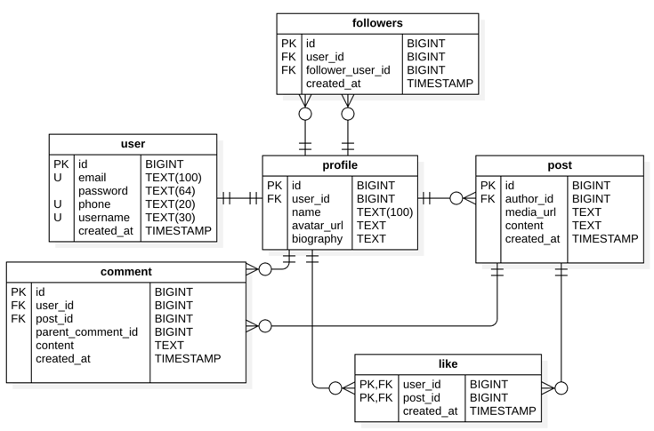

# Проектирование высоконагруженных систем
Расчетно-пояснительная записка к курсовой работе по предмету "Проектирование высоконагруженных систем".  
## 1. Тема и целевая аудитория
### Тема
Instagram - социальная сеть для обмена фотографиями и видео
### Целевая аудитория
- Весь мир
- MAU: 2 млрд
### Функционал
- Публикация постов (фотографий и видео)
- Реакция на публикации (лайки и комментарии)
- Подписка на контент других пользователей
- Лента новостей
### Продуктовые решения
- Рекомендательный алгоритм на основе действий пользователя для показа интересного пользователю контента 
- Лента формируется на основе подписок пользователя и рекомендаций пользователю
- Хэштеги - для поиска постов по тегам
## 2. Расчет нагрузки
### Продуктовые метрики
| Метрика                                                                 | Значение   |
|-------------------------------------------------------------------------|------------|
| Месячная аудитория                                                      | 2 млрд.    |
| Суточная аудитория*                                                     | 1,25 млрд. |
| Публикаций всего в день                                                 | 95 млн     |
| Среднее количество публикаций одним пользователем в день**              | 0,076      |
| Количество лайков одним пользователем в день                            | 8,4        |
| Среднее количество комментариев, оставляемых одним пользователем в день | 1          |
| Среднее время, проведенное в день                                       | 33,9 мин   |

*по [данным](https://backlinko.com/instagram-users) на 2017 год, mau = 800 млн., dau = 500 млн. (62,5% от mau). В 2024 mau составляет 2 млрд. человек. Возьмем такое же соотношение dau/mau, получим dau на 2024 год ```dau = 2 000 000 000 * 62,5% = 1 250 000 000```  
** ```95 000 000 / 1 250 000 000 = 0,076```
#### Средний размер хранилища пользователя по типам
Буду считать, что среднее время "жизни" пользователя равно 5 лет. 

| Тип                                         | Размер   |
|---------------------------------------------|----------|
| Данные пользователя (Имя, описание, аватар) | 1 Мб     |
| Подписки*                                   | 8 кб     |
| Лайки**                                     | 600 кб   |
| Комментарии***                              | 2 мб     |
| Публикации (фотографии + видео)****         | 1 057 мб |

*Большинство пользователей имеют от [1 000 до 10 000 подписчиков](https://backlinko.com/instagram-users#average-number-of-instagram-followers), 
количество подписок у пользователя значительно меньше. На основе анализа 50 активных пользователей Instagram: 
количество подписок находится в диапазоне от 1 до ~700, большинство пользователей имеет от 90 до 300 подписок. 
Исходя из этого возьму среднее количество подписок равное 200. Тогда размер подписок у пользователя будет равен: 
```200 * (16+16+8) = 8 000 байт ~ 8 кб```  
** ```5 лет * 365 дней * 8,4 лайка/день * 40 байт = 613 200 байт ~ 600 кб```  
*** Комментарий может содержать максимум 2 000 символов, но большинство комментариев содержит до 500 символов => возьму 500 символов, как среднее значение: 
```5 лет * 365 дней * 1 комм./день * (500*2 + 40) байт ~ 2 мб```  
****На основе данных из [marketingscoop.com](https://www.marketingscoop.com/blog/how-many-posts-are-posted-on-instagram-per-day/#:~:text=Photos%3A,and%20discovery%20pages) в день публикуется 48,2 млн фотографий в день и 22,8 млн видео в день, отсюда посчитаю соотношение 
```22,8/(48,2 + 22,8) * 100% = 32% от всего контента занимают видео```  
Учитывая, что источник предоставляет устаревшие данные, анализ 10 активных пользователей показал преобладание видео над фотографиями, и стремительно растущие тенденции к видеоконтенту (большая вовлеченность в видеоконтенте, короткие ролики, алгоритмы рекомендаций), 
то возьму соотношение видео к фото ```60 на 40```  
Количество публикаций у пользователя: ```5 лет * 365 дней * 0,076 публикаций/день ~ 140```  
[Битрейт](https://instaprofi.org/blog/interesnoe/parametry-video-v-instagram) видео составляет 3 000 кбит/с, средняя продолжительность ролика возьму 30 секунд, тогда средний размер видео ```3 000 кбит/c * 30 c ~ 11,25 мб ```  
**Размер** публикаций у пользователя ```(140 * 0,6) * 11,25 мб + (140 * 0,4) * 2 мб ~ 1057 мб ```
### Технические метрики
#### Размер хранения в разбивке по типам данных
| Тип                      | Количество, шт                                                  | Размер, ТБ |
|--------------------------|-----------------------------------------------------------------|------------|
| Фотографии + видеоролики | > 50 млрд.                                                      | 360 012*   |
| Данные профиля           | 2 млрд                                                          | 1 907**    |
| Лайки                    | ```2 млрд * 5 лет * 365 дней * 8,4 лайка/день = `30 660 млрд``` | 1 117***   | 
| Комментарии              | ```2 млрд * 5 лет * 365 дней * 1 комм./день = `3 650 млрд```    | 3 800****  | 
| Подписки                 | ```2 млрд * 200 = 400 млрд ```                                  | 15*****    | 

*Исходя из того, что видеоролики составляют примерно 60% от всех публикаций, получаем, что видеороликов примерно 30 млрд, и 20 млрд фотографий.   
Общий размер публикаций = количество видеороликов * средний размер видеоролика + количество фотографий * средний размер фотографии = `30 000 000 000 * 11,25 Мб + 20 000 000 000 * 2 Мб = 377 500 000 000 МБ = 
= 360 012 ТБ  
** 2 000 000 000 * 1 мб = 1 907 тб  
*** 600 кб * 2 млрд = 1 200 000 000 000 кб = 1 117 ТБ  
**** 2 мб * 2 млрд = 3 800 ТБ  
***** 2 млрд * 8 кб = 15 ТБ
#### Сетевой трафик
Так как Instagram используют по всему миру, то в разных часовых поясах будут разное пиковое время использования. Поэтому возьмем пиковое значение * 2 от среднесуточного. 
Расчет пикового значения - `(среднесуточное гбайт/сутки)*8/86400 * 2`

| Тип                             | Суточное, Гбайт/сутки | Пиковое, Гбит/с |
|---------------------------------|-----------------------|-----------------|
| Публикация фотографии           | 74 218                | 14              | 
| Публикация видео                | 612 304               | 113             |
| Проставление лайков             | 391                   | 0,07            |
| Комментирование                 | 1 210                 | 0,3             |
| Запрос блока публикаций         | 17 484                | 3,2             |
| Запрос контента (фото/видео)    | 1 475 ТБ/сутки        | 280             |
| Статистика (фиксация просмотра) | 3 772                 | 0,7             |

**Количество публикуемых фото и видео в сутки**  
В сутки публикуется около 95 млн постов => 57 млн - видео, 38 млн - фотографии  

**Количество просмотренных публикаций пользователем в сутки**  
Для расчета трафика просмотра публикаций возьму следующие данные:
- пользователь 80% времени смотрит короткие ролики длительностью в среднем 20 секунд, и в минуту успевает посмотреть около 4 роликов
- остальные 20% времени пользователи смотрит фотографии в ленте или в профиле другого пользователя, успевая посмотреть в минуту около 10 фотографий
- пользователь в среднем в день проводит на платформе 33,9 минуты  
`33,9 * 0,8 * 4 = 108` - видео смотрит пользователь за день  
`33,9 * 0,2 * 10 = 67` - фото смотрит пользователь за день  
`122 + 40 = 162` - публикаций всего смотрит пользователь за день  

**Расчеты:**  
Публикация фото: `57 млн × 2 МБ = 74 218 Гбайт/сутки`  
Публикация видео: `47,5 млн × 11,25 МБ = 612 304 Гбайт/сутки`  
Проставление лайков: `1,25 млрд * 8,4 * 40 байт = 391 Гбайт/сутки`  
Комментирование: `1,25 млрд * 1 * (500*2 + 40) байт = 1 210 Гбайт/сутки`  
Запрос блока публикаций: (будем запрашивать по 30 публикаций) `162/30 * 1,25 млрд * 2 кб = 17 484 Гбайт/сутки`  
Запрос контента: `1,25 млрд * (122 * 10 мб + 40 * 1,5 мб) = 1 475 ТБ/сутки`  
Статистика: `162  * 1,25 млрд * 20 байт = 3 772 Гбайт/сутки `

#### RPS
Расчет пикового значения - `(среднесуточное rps) * 2`

| Тип                     | Суточное, запросов в секунду | Пиковое, запросов в секунду |
|-------------------------|------------------------------|-----------------------------|
| Публикация фотографии   | 430                          | 860                         | 
| Публикация видео        | 645                          | 1290                        |
| Запрос контента         | 4 708 300                    | 9 416 600                   |
| Запрос блока публикаций | 86 805                       | 173 610                     |
| Статистический запрос   | 4 708 300                    | 9 416 600                   |
| Комментирование         | 14 467                       | 28 934                      |
| Проставление лайков     | 121 528                      | 243 056                     |

В секунду публикуется 1074 поста => 645 видео, 430 фото  
`((33,9 * 0,8) * 7 + (33,9 * 0,2) * 20) * 1,25 млрд / 86400 = 4 708 300`  

`1,25 млрд / 86400 = 14 467`  

`1,25 млрд * 8,4 / 86400 = 121 528` 

`1,25 млрд * 6 / 86400 = 86 805`

## 3. Глобальная балансировка нагрузки
### Расположение ДЦ
Instagram - приложение, которое используют по всему миру. 
Страны с наибольшим количеством пользователей:  

| Страна         | Кол-во пользователей, млн | %      |
|----------------|---------------------------|--------|
| Индия          | 385,35                    | 19,27% |
| США            | 166,15                    | 8,31%  |
| Бразилия       | 135,05                    | 6,75%  |
| Индонезия      | 99,4                      | 4,97%  |
| Турция         | 58,45                     | 2,92%  |
| Япония         | 55,5                      | 2,78%  |
| Мексика        | 46,7                      | 2,34%  |
| Германия       | 32,85                     | 1,64%  |
| Великобритания | 31,9                      | 1,60%  |
| Италия         | 28,45                     | 1,42%  |


| ДЦ                        | Роль        | Типы запросов                                | Область покрытия                                                     | Пользователи, % | Пиковые значения RPS |
|---------------------------|-------------|----------------------------------------------|----------------------------------------------------------------------|-----------------|----------------------|
| США (Нью-Йорк)            | Основной ДЦ | Публикация, комментирование, лайки, подписка | Весь мир                                                             | 100%            | 247 140              |
| США (Нью-Джерси)          | CDN         | Медиа-запросы (загрузка фото и видео)        | США, Мексика, Канада                                                 | 25%             | 2 032 696            |
| Европа (Франкфурт)        | CDN         | Медиа-запросы (загрузка фото и видео)        | Германия, Великобритания, Италия, Испания, Франция, Восточная Европа | 25%             | 2 032 696            |
| Азия (Мумбаи)             | CDN         | Медиа-запросы (загрузка фото и видео)        | Япония, Индия, Индонезия, Китай, Юго-Восточная Азия                  | 30%             | 2 439 236            |
| Австралия (Сидней)        | CDN         | Медиа-запросы (загрузка фото и видео)        | Австралия, Новая Зеландия                                            | 5%              | 406 53               |
| Африка (Кейптаун)         | CDN         | Медиа-запросы (загрузка фото и видео)        | Южная Африка, Нигерия, Кения                                         | 5%              | 406 53               |
| Южная Америка (Сан-Паулу) | CDN         | Медиа-запросы (загрузка фото и видео)        | Бразилия, Аргентина, Чили, Колумбия                                  | 10%             | 813 079              |


### Глобальная балансировка
Так как ДЦ распределены между континентами и странами, поэтому ip-адреса будет легче различать географически. Поэтому буду использовать для DNS балансировки **GeoDNS**. Он будет направлять пользователей к ближайшему CDN узлу для обслуживания медиа-запросов.

## 4. Локальная балансировка

### Схема балансировки для входящих и межсервисных запросов
Для входящий и межсервисных запросов будет работать L7-балансировка, будет использоваться Nginx. Алгоритмы балансировки: LeastConnections для сервисов которые работают с базой данных и обработкой медиа-запросов. Для других сервисов будет использоваться RoundRobin.
### Схема отказоустойчивости
Для отказоустойчивости на уровне маршрутизации будет использоваться протокол VRRP. Он позволяет нескольким маршрутизаторам действовать как "одно целое", предоставляя им виртуальный ip-адрес. И в случае сбоя главного маршрутизатора резервный автоматически возьмет управление на себя.  
Также Nginx будет проводить healthCheck и в случае отказа какого-либо из сервисов будет перенаправлять трафик.
### Терминация SSL
ssl-терминация будет проводиться на балансировщике Nginx.

## 5. Логическая схема БД

### Описание таблиц
| Таблица   | Поля                                                         | Размер одной записи           | Количество записей | Вес    |
|-----------|--------------------------------------------------------------|-------------------------------|--------------------|--------|
| User      | id, email, password, phone, username, created_at             | `8+102+66+22+32+8= 238 байт`  | 2 млрд             | 443 Гб |
| Profile   | id, user_id, name, avatar_url, biography                     | `8+8+102+256+1002= 1376 байт` | 2 млрд             | 2,5 Тб |
| Post      | id, author_id, media_url, content, created_at                | `8+8+256+2002+8= 2282 байт`   | 50 млрд            | 104 Тб |
| Comment   | id, user_id, post_id, parent_comment_id, content, created_at | `8+8+8+8+2002+8= 2042 байт`   | 100 млрд           | 185 Тб |
| Like      | user_id, post_id, created_at                                 | `8+8+8= 24 байт`              | 500 млрд           | 11 Тб  |
| Followers | id, user_id, follower_user_id, created_at                    | `8+8+8+8= 32 байт`            | 400 млрд           | 12 Тб  |

### Чтение/запись
| Таблица   | Чтение, QPS | Запись, QPS | 
|-----------|-------------|-------------|
| User      |             |             | 
| Profile   |             |             | 
| Post      |             |             | 
| Comment   |             |             | 
| Like      |             |             |
| Followers |             |             |


## 6. Физическая схема БД
## 7. Алгоритмы
## 8. Технологии


## Источники
1. https://sproutsocial.com/insights/instagram-stats/
2. https://whatsthebigdata.com/instagram-statistics/
3. https://www.socialpilot.co/instagram-marketing/instagram-stats
4. https://earthweb.com/blog/how-many-pictures-are-on-instagram/
5. https://www.statista.com/topics/1882/instagram/#topicOverview
